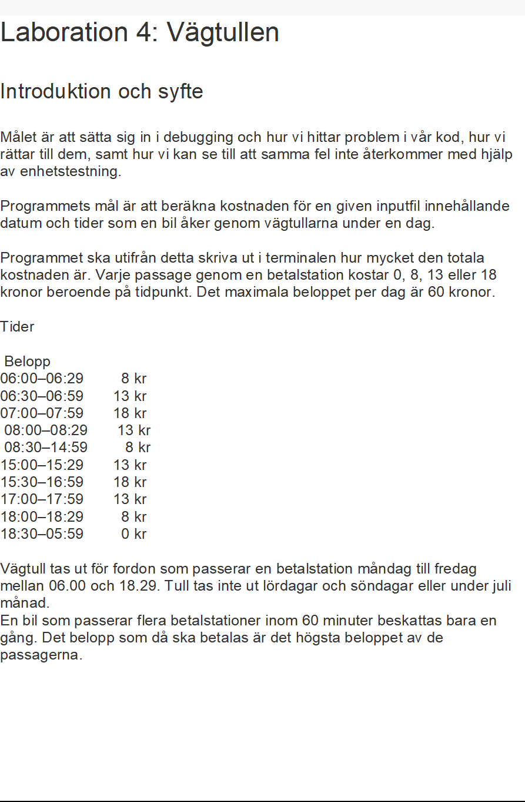

------------

Assignment : The Toll

The goal is to use debugging to find and fix buggs in the code, and to write unittest
to make sure that the same bugs do not happen again. 

The programs goal is to calculate the fee from a textfile containing 
the dates and times a car drives through a toll-station during one day.

The program should print out, in the terminal, how much the total amount is. 
Every passage through a station costs 0, 8, 13 or 18 kr depending on what time and date it is. 
The maximum amount is 60 kr /day. 

Time and kr to pay:

*06:00-06:29 8kr

*06:30-06:59 13kr

*07:00-07:59 18kr

*08:00-08:29 13kr

*08:30-14:59 8kr

*15:00-15:29 13kr

*15:30-16:59 18kr

*17:00-17:59 13kr

*18:00-18:29 8kr

*18:30-05:59 0kr

Monday - friday between 06.00-18.29 it costs money to pass 
the toll-station. Saturdays and sundays are free of charge, 
as well as month of july. 
A car that passes moore than one toll-station within an hour, is only being
charged for one fee, and it´s the most expensive one. 

//Carola Lindfors Sejsing
